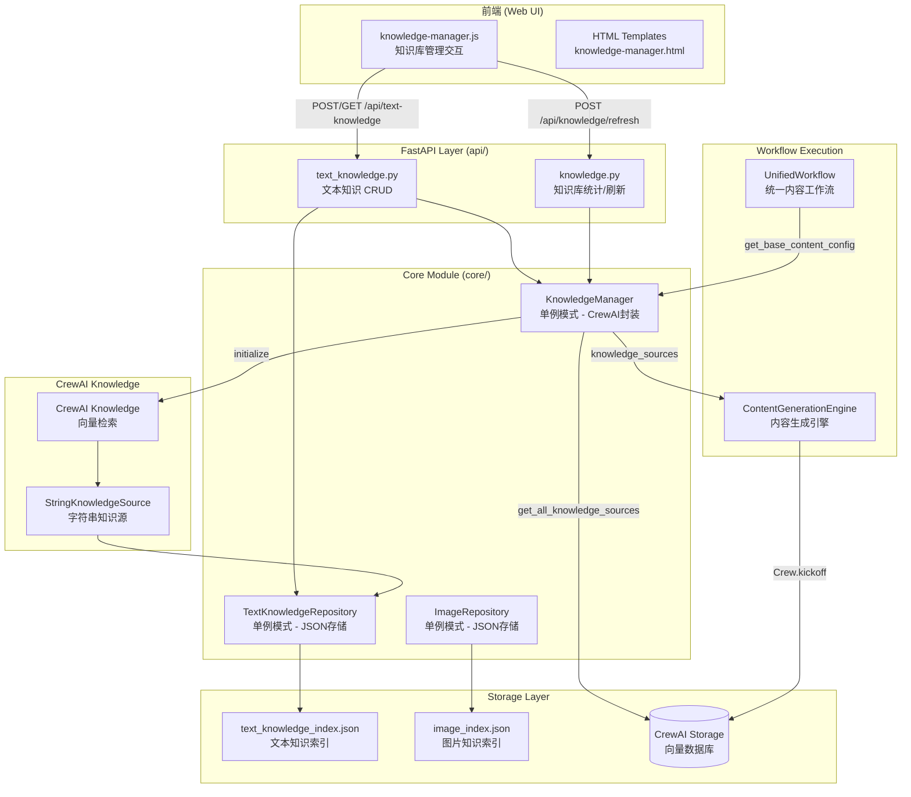
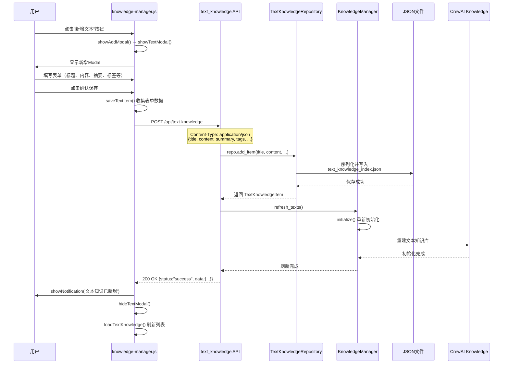
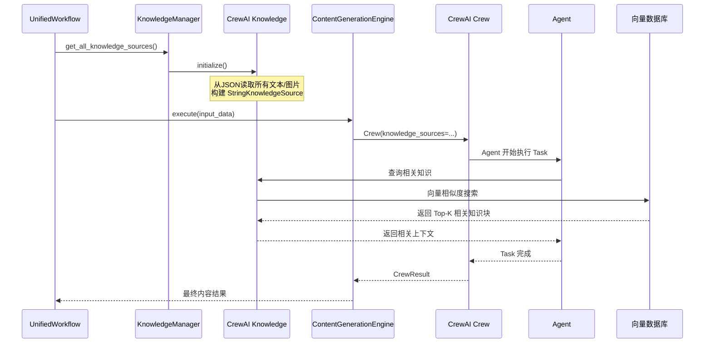

# 知识库调用流程图

> 本文档使用 Mermaid 图表说明 AIWriteX 知识库的整体架构和调用链。

---

## 1. 知识库整体架构图



---

## 2. 新增文本知识时序图



---

## 3. AI/Agent 调用知识库流程

### 3.1 初始化阶段

```mermaid
flowchart TB
    subgraph Init["初始化阶段"]
        direction TB
        A1[Config加载<br/>config.yaml] --> A2[UnifiedWorkflow实例化]
        A2 --> A3[get_base_content_config()]
        A3 --> A4[KnowledgeManager.get_all_knowledge_sources()]
        A4 --> A5[返回 List&lt;BaseKnowledgeSource&gt;]
    end

    subgraph Setup["CrewAI Crew 构建"]
        direction TB
        B1[ContentGenerationEngine初始化] --> B2[传入 knowledge_sources]
        B2 --> B3[传入 embedder 配置]
        B3 --> B4[Crew(agents, tasks, knowledge_sources...)]
    end

    A5 --> B4
```

### 3.2 执行阶段时序图



---

## 4. 关键文件索引

| 层次 | 文件路径 | 说明 |
|------|----------|------|
| 前端 | `src/ai_write_x/web/static/js/knowledge-manager.js` | 知识库管理交互逻辑 |
| 前端 | `src/ai_write_x/web/templates/components/views/knowledge-manager.html` | 知识库页面模板 |
| API | `src/ai_write_x/web/api/text_knowledge.py` | 文本知识 REST API |
| API | `src/ai_write_x/web/api/knowledge.py` | 统一知识统计/刷新 API |
| Core | `src/ai_write_x/core/knowledge_manager.py` | CrewAI Knowledge 封装 |
| Core | `src/ai_write_x/core/text_knowledge_repository.py` | 文本知识存储 (JSON) |
| Core | `src/ai_write_x/core/image_repository.py` | 图片知识存储 (JSON) |
| Workflow | `src/ai_write_x/core/unified_workflow.py` | 工作流编排器 |
| Workflow | `src/ai_write_x/core/content_generation.py` | 内容生成引擎 |

---

## 5. 配置说明

知识库 embedder 配置位于 `config.yaml`:

```yaml
knowledge:
  embedder:
    provider: openai        # openai / ollama / deepseek 等
    api_key: sk-xxx        # API密钥
    model: text-embedding-3-small  # 嵌入模型
    base_url: https://api.openai.com/v1  # API地址
```

CrewAI 存储目录: `{app_data_dir}/knowledge_storage/`